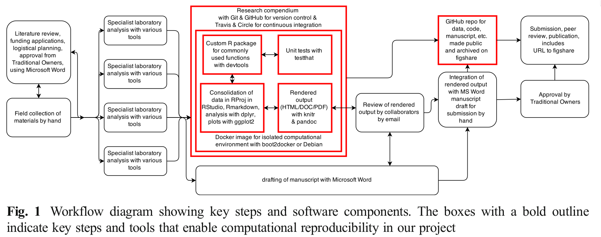

layout: true
<div class="my-header"></div>

```{r setup, include=FALSE}
system(command = "rm -r moin")
```


---

# Introduction: Packages...?!

- A package is the fundamental unit of shareable code. It bundles together code, data, documentation, and tests.
--

- There are .bold[a lot] of R packages out there (as of 2018-07-26 there are 12784 packages available in the CRAN repository)
--

- Thanks to the `devtools` package it is easy to create and share your package with others.
--

- Great .bold[references] to start are: 
  - Wickham, H., 2015. R Packages: Organize, Test, Document, and Share Your Code, 1 edition. ed. O’Reilly Media, Sebastopol, CA.
  - A minimal but rather comprehensive tutorial: https://kbroman.org/pkg_primer/
  - Writing R Extensions ([link](https://cran.r-project.org/doc/manuals/r-release/R-exts.html))
  - Writing an R package from scratch ([link](https://hilaryparker.com/2014/04/29/writing-an-r-package-from-scratch/))


---


# Introduction

Why do we want to develop a package? 
--

- turn your long, individualized script into general functions
--

- reproducible
--

- easy to distribute
--

- cross-platform (since R is cross-platform)
--

- documentation

---

# Introduction

Why do we want to develop a package? 

.bold[Because it helps us to conduct .underline[reproducible research].]

.center[]


.reference[Marwick, B., 2017. Computational Reproducibility in
Archaeological Research: Basic Principles and a Case Study of Their
Implementation. Journal of Archaeological Method and Theory 24,
424–450. https://doi.org/10.1007/s10816-015-9272-9]

---

# Introduction

General structure of a package

```
PackageName/
├─DESCRIPTION
├─INDEX
├─NAMESPACE
├─R/
├─data/
├─demo/
├─exec/
├─inst/
├─man/
├─src/
└─tests/
```

Further infos:
- Section in Writing R Extentsion ([link](https://cran.r-project.org/doc/manuals/r-release/R-exts.html#Package-structure))
- Screenshot tutorial with futher links ([link](http://www.mjdenny.com/R_Package_Pictorial.html))
- Ligges, U., 2008. Programmieren mit R, Springer, Berlin. (p 199ff.)


---

# DiY: Create empty package

--

Let's use `devtools` to create our `moin` package

```{r init, echo=FALSE}
if (dir.exists("moin")) {
  unlink("moin", recursive = TRUE)
}
```

```{r, eval=FALSE}
library(devtools)
devtools::create(path = "./moin")
```
--

```{r, echo=FALSE}
library(devtools)
devtools::create(path = "./moin")
```

---

# DiY: Edit Description -- License

The metadata of your package are stored in the `DESCRIPTION` file.

`devtools::create("mypackage")` already added a bare-bones description file that we can edit manually or using some handy functions from the `devtools` package

--

.pull-left[
...we can use a function to create a license for our package

```{r}
devtools::use_gpl3_license(pkg = "./moin")
```
]

--

.pull-right[
```{r engine='bash', comment='', echo=FALSE}
cat moin/DESCRIPTION
```
]

--

Which license to chose? Research and decide yourself
- https://choosealicense.com/
- Morin, A., Urban, J., Sliz, P., 2012. A Quick Guide to Software Licensing for the Scientist-Programmer. PLOS Computational Biology 8, e1002598. https://doi.org/10.1371/journal.pcbi.1002598
- general advice by Karl Broman: http://kbroman.org/pkg_primer/pages/licenses.html


???

- [informal advice](https://blog.codinghorror.com/pick-a-license-any-license/): "I hate software licenses. When I read a software license, what I see is a bunch of officious, mind-numbing lawyerly doublespeak. Blah, blah, blah.. kill me now." 

---

# DiY: Edit Description -- Author, etc.

My `DESCRIPTION` file after manually adding further information

```{r description, echo=FALSE}
writeLines(c(
'Package: moin',
'Title: Modelling Spatial Interactions in R',
'Description: This package provides functions to calculate simple
    location and interaction models. It is based on the gravity and
    entropy maximization approaches. These can be defined within the
    deterrence (or cost) functions. Two functions are implmented,
    covered singly- as well as doubly-constrained models.',
'Version: 0.0.0.9000',
'Authors@R: c(
  person("Daniel", "Knitter", email = "knitter@geographie.uni-kiel.de", role = c("aut","cre")))',
'URL: HOMEPAGE TO BE AVAILABLE SOON',
'BugReports: https://github.com/ISAAKiel/moin/issues',
'Depends: R (>= 3.5)',
'License: GPL-3 + file LICENSE',
'Encoding: UTF-8',
'LazyData: true'), 'moin/DESCRIPTION')
close(file('moin/DESCRIPTION'))
```

```{r engine='bash', comment='', echo=FALSE}
cat moin/DESCRIPTION
```
---

# DiY: Package dependencies

If you use functions from other packages you need to inform the users (or rather their computers) about it. This is done by mentioning the relevant packages/functions in the `DESCRIPTION` file. We can use `devtools` to take care of this edit ([further infos](http://r-pkgs.had.co.nz/description.html#dependencies))
--

.pull-left[
Code to run:

```{r}
devtools::use_package(package = "sf",
                      type = "Imports",
                      pkg = "./moin")
```
]

--

.pull-right[
Resulting description file:

```{r engine='bash', comment='', echo=FALSE}
cat moin/DESCRIPTION
```
]

- Now we can use functions from the `sf` package by calling: `sf::fun()`
- Note the difference between `Import` and `Suggest`

---

# DiY: Add some R code and document it

R-code is stored in the `R` folder under your package directory. Let's create a `hello-world.R` file where we create a simple function and document it in place.

```{r exampleCode, eval = FALSE}
hello_function <- function(name) {
  print(paste0("Hello, ", name, "!"))
  }
```

--

Now, let's add the documentation using `roxygen` comments `#'`

```{r exampleCodedocu, eval = FALSE}
##' .. content for \description{} (no empty lines) ..
##'
##' .. content for \details{} ..
##' @title hello_function
##' @param name a name
##' @return a greeting
##' @example hello_function(name = "World")
##' @export
hello_function <- function(name) {
  print(paste0("Hello, ", name, "!"))
  }
```

```{r echo=FALSE}
writeLines(c("##' room for the DESCRIPTION
##'
##' and more DETAILS
##' @title hello_function
##' @param name a name##' 
##' @return a greeting
##' @export
hello_function <- function(name) {
  print(paste0('Hello, ', name, '!'))
  }"), "moin/R/hello_function.R")
close(file('moin/R/hello_function.R'))
```


---

# DiY: Add some R code and document it

```{r testdic1}
devtools::document(pkg = "./moin") #  calls roxygen2::roxygenise() to do the hard work
```

Use `?` or `help()` to adjust your documentation until you like it. 

Please check in your package folder: `man/` as well as `NAMESPACE`

further infos:

- [Object documentation from Hadley](http://r-pkgs.had.co.nz/man.html)
- [field description in roxygen2](https://cran.r-project.org/web/packages/roxygen2/vignettes/rd.html)
- [roxygen2 in general](https://cran.r-project.org/web/packages/roxygen2/vignettes/roxygen2.html)
- [the "old" Rd format](https://cran.r-project.org/doc/manuals/r-release/R-exts.html#Writing-R-documentation-files)

---

# DiY: Install the package

Let's install the package

```{r testdic2}
devtools::install(pkg = "./moin") #  calls roxygen2::roxygenise() to do the hard work
```

- `devtools::install`: Uses `R CMD INSTALL` to install the package.  Will also try to install dependencies of the package from CRAN, if they’re not already installed
- `devtools::build`: Building converts a package source directory into a single bundled file. By default creates a `tar.gz` package that can be installed.

---


# Our goal

Arrive at version 1.0.0 [no pressure ;) ]

By the way, infos on how to version your package are given e.g. here: [link](http://r-pkgs.had.co.nz/description.html#version)
